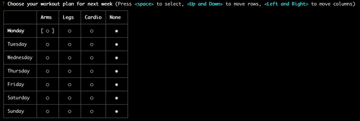

# inquirer-radiomatrix-prompt 



This is an Inquirer Prompt package based on Table Prompt from @eduardoboucas.

I've decided to publish this version because apparently Eduardo had abandoned his library, and it has a 
couple of functional issues that have been not fixed in the last 2 years.

This library provide a different output json format with more information, and allow you to input default values.

If you have any improvement please create a pull request, and I'll be happy to review and merge if it's convenient.


## Installation

```
npm i inquirer-radiomatrix-prompt
```

## Usage

### Typescript
```typescript
import inquirer from "inquirer";
import inquirerRadioSelection from "inquirer-radiomatrix-prompt";

inquirer.registerPrompt('radiomatrix', inquirerRadioSelection);

const answers = await inquirer.prompt([
    {
        type: 'radiomatrix',
        name: 'projects',
        message: 'Mark the projects priorities',
        columns: [
            {
                name: 'None',
                value: undefined
            },
            {
                name: 'Low',
                value: 'low'
            },
            {
                name: 'Medium',
                value: 'medium'
            },
            {
                name: 'High',
                value: 'high'
            },
            {
                name: 'Critical',
                value: 'critical'
            }
        ],
        rows: [
            {
                name: 'Ecommerce Store',
                value: 'ecommerce-store'
            },
            {
                name: 'Branding Page',
                value: 'branding-page'
            },
            {
                name: 'Landing Page',
                value: 'landing-page'
            },
            {
                name: 'Marketing Plans',
                value: 'marketing-plans'
            }
        ]
    }
]);
```

### Javascript
```js
const inquirerRadioSelection = require('inquirer-radiomatrix-prompt');

inquirer.registerPrompt('radiomatrix', inquirerRadioSelection);

inquirer.prompt([
    {
        type: 'radiomatrix',
        name: 'projects',
        message: 'Mark the projects priorities',
        columns: [
            {
                name: 'None',
                value: undefined
            },
            {
                name: 'Low',
                value: 'low'
            },
            {
                name: 'Medium',
                value: 'medium'
            },
            {
                name: 'High',
                value: 'high'
            },
            {
                name: 'Critical',
                value: 'critical'
            }
        ],
        rows: [
            {
                name: 'Ecommerce Store',
                value: 'ecommerce-store'
            },
            {
                name: 'Branding Page',
                value: 'branding-page'
            },
            {
                name: 'Landing Page',
                value: 'landing-page'
            },
            {
                name: 'Marketing Plans',
                value: 'marketing-plans'
            }
        ]
    }
]).then(answers => {
    console.log(answers);
});
```

## Results
```json
{
  "projects": [
    {
      "column": "low",
      "row": "ecommerce-store"
    },
    {
      "column": "critical",
      "row": "branding-page"
    },
    {
      "column": "medium",
      "row": "landing-page"
    },
    {
      "column": "high",
      "row": "marketing-plans"
    }
  ]
}
```

### Options

- `columns`: Array of options to display as columns. Follows the same format as Inquirer's `choices`
- `rows`: Array of options to display as rows. Follows the same format as Inquirer's `choices`
- `pageSize`: Number of rows to display per page
- `default`: Default value in the same format as output
